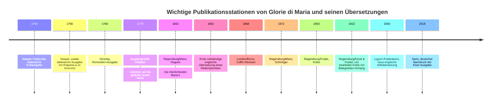

# Verfügbarkeit des italienischen Originaltexts und Übersetzungen von Glorie di Maria

## Executive Summary

Der Kernbefund ist klar: **Ja, der italienische Originaltext ist heute frei online zugänglich** – und zwar in einer für wissenschaftliche Arbeit brauchbaren Form. Der frei lesbare Volltext bei **IntraText** entspricht nach einer neueren einschlägigen Dissertation der Standardausgabe der *Opere ascetiche*, Bde. VI–VII; außerdem erklärt die IntraText-Redaktionsseite selbst, dass diese Fassung auf der kritischen Überlieferungsarbeit zu den *Opere ascetiche* beruht. Zusätzlich existieren frei zugängliche ältere italienische Faksimiles (vor allem Google Books) sowie ein frei erreichbarer Scan einer römischen *Opere ascetiche*-Reihe bei Internet Archive. citeturn30search0turn30search1turn30search7turn30search11turn32view0turn0search6turn2view1

Für die **Editionsgeschichte** ist entscheidend: Erstauflage Neapel 1750; zweite Auflage 1756 mit vor allem orthographischen Änderungen und dem Zusatz der *Risposta a un Anonimo*; sodann eine vom Autor für eine Gesamtausgabe vorbereitete, zu Lebzeiten nicht gedruckte Revision auf Grundlage der venezianischen Remondini-Ausgabe von 1760, die in der späteren Forschung als „**Bassanese**“ maßgeblich wurde. Die kritische Textgestalt der modernen Standardausgabe versucht genau diese vom Autor gewünschte Endstufe zu rekonstruieren. Bedeutende Varianten betreffen nicht nur einzelne Wörter, sondern auch die **Disposition** des Werkes, besonders die Stellung der Canzoncine, der Mariengebete und der Appendizes. citeturn2view0turn32view0turn33view0

Bei den **Übersetzungen** ergibt sich ein deutliches Bild: Im Englischen dominiert historisch die anonyme Redemptoristen-Übersetzung von 1852 und deren Revisionslinie über Robert A. Coffin bis zu gegenwärtigen Reprints; als einzige im priorisierten Quellenkorpus klar identifizierbare neuere vollständige englische Ausgabe erscheint die Liguori-Publications-Ausgabe von 2000 („a new translation from the Italian“), daneben eine gekürzte Fassung bei Alba House 1990. Im Deutschen reicht die Überlieferung mindestens bis Peter Ob ladens/Augsburger Fassung im 18. Jahrhundert zurück; dem 19. und frühen 20. Jahrhundert verdankt man dann die Hugues-, Schmöger- und Krebs/Litz-Linien. **Eine wirklich neue, eigenständige moderne wissenschaftlich-kritische deutsche oder englische Übersetzung konnte ich in den priorisierten Quellen nicht nachweisen**; der heutige Gebrauch beruht im Wesentlichen auf Reprints älterer Übersetzungen. citeturn34search0turn27search9turn10search1turn29search2turn19search4turn20search7turn13search3turn14search0

## Quellenlage und Editionsgeschichte

Die editorische Lage ist ungewöhnlich günstig, weil sich hier **digitale Primärquellen** und **editorische Sekundärquellen** gut ergänzen. Für die frühe Überlieferung sind vor allem die italienischen Google-Books-Digitalisate der Ausgaben von 1760 und 1831 wichtig; für die kritische Textgestalt sind die IntraText-Seiten und ihre eigene Editionsbeschreibung zentral; für die Rezeptions- und Übersetzungsgeschichte sind HathiTrust, Internet Archive, Google Books, das bibliographische Material der **entity["organization","Deutsche Nationalbibliothek","german national library"]**, der **entity["organization","Library of Congress","us national library"]**, von **entity["organization","WorldCat","library union catalog"]**, der Deutschen Digitalen Bibliothek sowie einschlägige redemptoristische Bibliographien ergiebig. citeturn0search1turn30search0turn32view0turn3search0turn12search13turn10search1turn29search2

Für die Textgeschichte des italienischen Originals sind vier Stufen wichtig. Die IntraText-Scheda nennt die Erstausgabe 1750 in Neapel bei Pellecchia, die zweite Auflage 1756 ebendort, die venezianische Remondini-Ausgabe 1760 und die spätere neapolitanische Stasi-Ausgabe 1776. Die gleiche Scheda erläutert, dass die 1756er Auflage im Wesentlichen orthographische Änderungen brachte und die *Risposta a un Anonimo* anfügte. Für 1761/1760 ist besonders wichtig, dass Alphonsus eine weiter überarbeitete Fassung für eine Gesamtausgabe vorbereitete, die in den Remondini-Archiven liegenblieb, später nach Bassano gelangte und in der modernen Forschung als „Bassanese“ behandelt wird. Gerade diese Fassung bildet – unter Berücksichtigung der neapolitanischen Ausgabe von 1776 – den Grundpfeiler der späteren kritischen Edition. citeturn33view0turn32view0turn2view0

Die IntraText-Redaktionsseite beschreibt außerdem, was die kritische *Opere ascetiche*-Edition leisten wollte: Wiederherstellung des ursprünglichen Texts und Prüfung der von Alphonsus zitierten Autoritäten und Exempla; sie hebt ausdrücklich hervor, dass ältere Marietti- und andere Nachdrucke den Text oft frei behandelten. Eine neuere deutsche Dissertation formuliert den für dein Projekt wichtigsten Punkt sehr deutlich: Der online bereitgestellte IntraText-Text sei **mit der Standardausgabe der *Opere ascetiche* VI–VII identisch**, auch wenn die Seitenzählung abweicht. Für ein meditationsorientiertes, aber textbewusstes Arbeiten ist das ausgesprochen wertvoll. citeturn32view0turn30search7turn30search11

## Italienische Originalausgaben online

Wenn deine „*Opere ascetiche*, 1935“ die **kritische römische Standardausgabe** der *Le Glorie di Maria* meint, lautet die beste knappe Antwort: **Der Text ist online frei verfügbar, wenn auch nicht notwendig als identisches Seiten-Faksimile deines Bandes; textlich ist er über IntraText nachweislich zugänglich.** Wenn du hingegen die römische mehrbändige Reihe *Opere ascetiche di S. Alfonso Maria de Liguori* meinst, deren erster Band *Glorie di Maria* enthält, existiert zudem ein frei erreichbarer Internet-Archive-Scan einer entsprechenden Reihe. citeturn30search0turn30search1turn30search7turn30search11turn0search6turn2view1

**Tabelle A – Italienische Originalausgaben online (frei und kommerziell)**

| Titel | Übersetzer/Hrsg. | Jahr | Verlag | ISBN/Identifier | Sprache | PD-Status | Volltext/Katalog | Textgrundlage | Zuverlässigkeit / Apparat |
|---|---|---:|---|---|---|---|---|---|---|
| *Le glorie di Maria*, vol. 1–2 | — | 1760 | Remondini | Google-Books-Digitalisate | Italienisch | ja | Google Books Volltext, Bd. 1–2 citeturn0search10turn0search1turn33view0 | Zeitgenössische venezianische Ausgabe; wichtiger Zeuge der späteren autorisierten Revision („Bassanese“). citeturn33view0turn32view0 | Sehr hoch als Primärfaksimile; kein moderner Apparat. |
| *Opere complete: Le Glorie di Maria* 1–3 | — | 1831 | Giuseppe Antonelli Editore | Google-Books-Digitalisat | Italienisch | ja | Google Books Volltext/Katalog citeturn1search7turn1search3 | 19.-Jh.-Werkausgabe; keine kritische Rekonstruktion ausgewiesen. | Gut als Rezeptionszeugnis; textkritisch nachrangig. |
| *Glorie di Maria: testo* (IntraText CT) | Digitale Bereitstellung durch IntraText; Editor im Webtext nicht als Einzelperson genannt | 2006 (digitale Präsentation) | IntraText / EuloTech | IntraText-Text | Italienisch | ja (Text) | IntraText Volltext citeturn30search0turn30search1 | Nach neuer Dissertation identisch mit der Standardausgabe der *Opere ascetiche* VI–VII; die IntraText-EdCrit-Seite beschreibt die kritische Basis ausdrücklich. citeturn30search7turn30search11turn32view0 | **Bestes frei zugängliches Arbeitsmedium für den Text**; der vollständige gedruckte Apparat der Standardausgabe ist online nicht vollständig mitabgebildet. |
| *Opere ascetiche di S. Alfonso Maria de Liguori*, vol. 1 (enthält *Glorie di Maria*) | unbekannt | unbekannt | unbekannt | Internet-Archive-Identifier `opereascetichedi0002ligu` | Italienisch | ja / vermutlich ja | Internet Archive Scan citeturn0search6turn2view1 | Bandscan einer römischen *Opere ascetiche*-Reihe mit *Glorie di Maria* im ersten Band; bibliographische Feindaten im Treffertext unvollständig. | Nützlich als Faksimile; für exakte bibliographische Zitierung nur eingeschränkt. |
| *Le Glorie di Maria* | unbekannt | 1988 | Editrice Bettinelli | Google-Books-Katalogeintrag | Italienisch | nein | Google Books Katalog citeturn0search13 | Moderne Druckausgabe; im vorliegenden Treffer keine präzise Angabe zur benutzten italienischen Basis. | Solide als Druckausgabe, aber keine nachgewiesene kritische Leitfunktion im Treffer. |

Für Vorschaubilder und schnelle Faksimilekontrolle sind besonders die frei sichtbaren Google-Books-Ausgaben von 1760 und 1831 sowie die Internet-Archive-Bände nützlich; für die Arbeit am **Text** ist IntraText der praktischste Einstieg. citeturn0search10turn0search1turn1search7turn0search6turn30search0

image_group{"layout":"carousel","aspect_ratio":"16:9","query":["Le glorie di Maria 1760 Remondini title page","The glories of Mary 1852 title page","Die Herrlichkeiten Mariä 1872 Manz title page","Des hochwürdigsten Herrn Alphons de Liguorio Lobreden auf die göttliche Mutter Maria 1779 title page"],"num_per_query":1}

## Englische Übersetzungen

Im Englischen ist zunächst die **anonyme Redemptoristen-Übersetzung von 1852** grundlegend. Dann folgt die **Coffin-Linie** (1868 und ihre späteren Reprints), die bis in heutige TAN-Ausgaben hineinwirkt. Daneben existieren später eine „New Revised Edition“ bei P. J. Kenedy (1888), eine Benziger-Ausgabe von 1902 und die Grimm-/Redemptoristen-Sammelausgabe von 1931. Für den heutigen praktischen Gebrauch ist vor allem die Vollausgabe von 2000 bei Liguori Publications wichtig; eine gekürzte moderne Fassung erschien 1990 bei Alba House. citeturn23search6turn2view3turn21search1turn6search1turn19search4turn20search7

**Tabelle B – Englische Übersetzungen (public domain / ältere Ausgaben)**

| Titel | Übersetzer/Hrsg. | Jahr | Verlag | ISBN/Identifier | Sprache | PD-Status | Volltext/Katalog | Textgrundlage | Zuverlässigkeit / Apparat |
|---|---|---:|---|---|---|---|---|---|---|
| *The glories of Mary* | „a father of the same Congregation“ (anonym) | 1852 | New York: E. Dunigan and Brother / James B. Kirker late Edward Dunigan & Bro. | IA `TheGloriesOfMary1852`; LOC scan | Englisch | ja | Internet Archive / Library of Congress / HathiTrust / Google Books citeturn2view2turn3search0turn0search2turn23search6 | Erste vollständige englische Übersetzung, noch vor moderner kritischer Textrekonstruktion; auf dem Titel explizit als Übersetzung durch einen Redemptoristen ausgewiesen. citeturn23search6turn21search3 | Sehr wichtig für Rezeptionsgeschichte; kein kritischer Apparat. |
| *The glories of Mary; tr. from the Italian* | Robert A. Coffin (rev.) | 1868 | London: Burns | HathiTrust record | Englisch | ja | HathiTrust / Online Books Page citeturn2view3turn23search1 | Revision der älteren englischen Übertragung; später Grundlage der Coffin/TAN-Tradition. citeturn23search4 | Solide historische Standardfassung; keine moderne kritische Edition. |
| *The Glories of Mary. New Revised Edition* | Übersetzer unbekannt im Treffer; Revision anonym | 1888 | New York: P. J. Kenedy & Sons | IA `thegloriesofmary00liguuoft` | Englisch | ja | Internet Archive / eCatholic2000 citeturn21search0turn21search1turn21search3 | Titel nennt „new and improved translation“; genaue italienische Basis im vorliegenden Material nicht ausgewiesen. | Devotional stark wirksam; textkritisch nicht ausgewiesen. |
| *The glories of Mary* | Robert A. Coffin (wahrscheinlich; in späterem TAN-Reprint ausdrücklich so bezeichnet) | 1902 | Benziger Brothers | HathiTrust-Similar / PDF-Reprint-Spur | Englisch | ja | HathiTrust Similar Record / Benziger-PDF-Spur / TAN-Preview des Coffin-Texts citeturn2view4turn4search3turn23search4 | Späte Ausgabe der Coffin-Revisionslinie; genaue Titelblattzuordnung im frei sichtbaren Katalogtext nicht vollständig. | Gut als devotionaler Standardtext; für präzise bibliographische Arbeit Titelblatt verifizieren. |
| *The glories of Mary: two volumes in one; Glorie di Maria; Complete works…* | Eugene Grimm (Hrsg.) | 1931 | Redemptorist Fathers | IA item | Englisch | ja (Text; Scan von IA als PD behandelt) | Internet Archive citeturn3search3 | Sammelausgabe innerhalb der englischen *Ascetical Works*; textlich in der Grimm/Redemptoristen-Tradition. | Nützlich als späte Standardreprint-Fassung; kein neuer kritischer Apparat. |

**Tabelle C – Englische Übersetzungen (modern / maßgebliche Ausgaben)**

| Titel | Übersetzer/Hrsg. | Jahr | Verlag | ISBN/Identifier | Sprache | PD-Status | Volltext/Katalog | Textgrundlage | Zuverlässigkeit / Apparat |
|---|---|---:|---|---|---|---|---|---|---|
| *The Glories of Mary* | Msgr. Charles Dollen (gekürzte Übersetzung) | 1990 | Alba House | ISBN 0818905611 | Englisch | nein | Index Translationum / Buchdaten citeturn20search7turn20search16 | **Abridged translation**; nicht Volltext, sondern Auswahl/Fassung für devotionalen Gebrauch. | Für Einstieg brauchbar, für Vollstudium ungeeignet. |
| *The Glories of Mary* (rev. ed.; “A new translation from the Italian”) | Übersetzer im gesichteten Katalogmaterial **nicht genannt** | 2000 | Liguori Publications | ISBN 0764806645 | Englisch | nein | HathiTrust / Google Books / Buchdaten citeturn19search4turn19search11turn16search0 | Vom Verlag als **neue Übersetzung aus dem Italienischen** ausgewiesen; spezifische italienische Leit-Ausgabe im sichtbaren Katalogtext nicht genannt. | **Beste nachweisbare aktuelle vollständige englische Arbeitsausgabe** im priorisierten Korpus; aber kein ausdrücklich ausgewiesener textkritischer Apparat. |
| *The Glories of Mary* (aktuelle Deluxe-/Reprint-Tradition) | Robert A. Coffin (Revision der älteren Übersetzung) | unbekannt | TAN Books | ISBN 9781505133028 | Englisch | nein (Edition); zugrunde liegender Text alt | Aktuelle Verlagsseite / Preview citeturn20search19turn23search4turn20search8 | Baut auf der Coffin-Revisionslinie des 19. Jahrhunderts auf. | Devotional sehr brauchbar; wissenschaftlich sekundär, weil Reprint ohne neuen kritischen Apparat. |

Im priorisierten Quellenkorpus fand sich **keine moderne englische wissenschaftlich-kritische Ausgabe**, die den editorischen Anspruch der italienischen Standardausgabe ausdrücklich in vollem Umfang in die Übersetzung überträgt. Der englische Markt ist vielmehr eine Mischung aus historischer Übersetzungstradition, Reprints und einer neueren, aber apparatarmen Vollübersetzung von 2000. citeturn19search4turn20search7turn20search19

## Deutsche Übersetzungen

Die deutsche Überlieferung ist älter und vielfältiger, als man oft annimmt. Die IntraText-Scheda und ein Google-Books-Digitalisat weisen auf eine frühe deutsche Fassung unter dem Titel **„Lobreden auf die göttliche Mutter Maria“** hin, verbunden mit Peter Obladen und Augsburg/Veith. Im 19. Jahrhundert folgen die Übersetzungen bzw. Bearbeitungen von M. A. Hugues, Karl Schmöger und Anton Merk; im 20. Jahrhundert ist die Krebs/Litz-Ausgabe von 1903/1922 die wichtigste textnähere Station, während die heutige Verbreitung praktisch von der Kiser-/Sarto-Reprintlinie lebt. citeturn33view0turn34search0turn27search9turn10search1turn13search4turn29search2turn14search0

**Tabelle D – Deutsche Übersetzungen (public domain / ältere Ausgaben)**

| Titel | Übersetzer/Hrsg. | Jahr | Verlag | ISBN/Identifier | Sprache | PD-Status | Volltext/Katalog | Textgrundlage | Zuverlässigkeit / Apparat |
|---|---|---:|---|---|---|---|---|---|---|
| *Des hochwürdigsten Herrn Alphons de Liguorio … Lobreden auf die göttliche Mutter Maria* | Peter Obladen | 1779 | Veith (Augsburg) | Google-Books-Digitalisat | Deutsch | ja | Google Books Volltext citeturn34search0turn33view0 | Frühe deutsche Übersetzung einer frühen Werkgestalt; Titel und Disposition weichen von späteren „Herrlichkeiten“-Ausgaben ab. | Sehr wertvoll für Rezeptionsgeschichte; für den „Endtext“ des Autors nicht ideal. |
| *Die Herrlichkeiten Maria’s* / in *Die Verehrung der Heiligen* I–II | M. A. Hugues | 1842 / 1846 | Joseph Manz, Regensburg | zeitgenössische Bibliographien; kein moderner ISBN | Deutsch | ja | Zeitgenössischer Buchhandelsnachweis / antiquarischer Nachweis citeturn27search9turn27search14turn27search7 | „Neu aus dem Italienischen übersetzt und hrsg.“; frühe Werkausgabe in zwei Teilen. | Textgeschichtlich wichtig; kein moderner Apparat. |
| *Die Herrlichkeiten Mariens … für das dt. Volk umgearbeitet und mit Andachts-Übungen vermehrt* | Anton Merk; verbessert/hrsg. von J. B. Kempf | 1884 | Benziger, Einsiedeln | bibliogr. Nachweis | Deutsch | ja | Marienliteratur-Bibliographie citeturn13search4 | Deutlich **bearbeitete** Volksausgabe; nicht als exakte textkritische Übersetzung zu verwenden. | Für Frömmigkeitsgeschichte interessant, für philologische Arbeit ungeeignet. |
| *Die Herrlichkeiten Mariä* | P. C. E. / K. E. Schmöger | 1872 | Manz | Google-Books-Digitalisat | Deutsch | ja | Google Books Volltext/Katalog citeturn9search0turn10search8turn10search10 | „Neu aus dem Italienischen“; die klassische deutschsprachige Lesefassung des späten 19. Jahrhunderts. | Stilistisch flüssig; kein kritischer Apparat. |
| *Die Herrlichkeiten Mariä* (6. Aufl.) | K. E. Schmöger | 1891 | Manz, Regensburg | PPN 1484541596 | Deutsch | ja | Deutsche Digitale Bibliothek citeturn10search1 | Späte Auflage der Schmöger-Übersetzung. | Zeitgenössische Rezension nennt sie „leicht und angenehm zu lesen“, merkt aber sachliche Ergänzungsbedürftigkeit im Skapulier-Abschnitt an. citeturn8search2turn29search5 |
| *Die Herrlichkeiten Mariä vom hl. Kirchenlehrer Alfons Maria von Liguori* | P. Alois / Josef Alois Krebs | 1903 | Pustet, Regensburg | bibliogr. Nachweis | Deutsch | ja (US); EU wohl ja, aber im gesichteten Material nicht für jede Personendate verifiziert | Krebs-Bibliographie citeturn29search2 | Neu aus dem Italienischen übersetzt und herausgegeben. | Wichtig als neue 20.-Jh.-Fassung; apparatkritischer Umfang der Erstausgabe im Treffer nicht ausgeführt. |
| *Die Herrlichkeiten Mariä … Anhang: Die revidierten Belegstellen …* | Alois Krebs; bearb. von Jakob Litz | 1922 | Kösel & Pustet, Regensburg | OCLC 897197160 | Deutsch | ja (US); EU wohl ja, aber Todessdaten hier nicht durchgehend nachverifiziert | WorldCat / DDB / weitere Nachweise citeturn12search13turn12search9turn29search2turn29search11 | Zweite, vollständig umgearbeitete Ausgabe mit **revidierten Belegstellen und kritischen Erläuterungen**. | **Stärkste ältere deutsche Studienausgabe** im priorisierten Material. |

**Tabelle E – Deutsche Übersetzungen (modern / maßgebliche Ausgaben)**

| Titel | Übersetzer/Hrsg. | Jahr | Verlag | ISBN/Identifier | Sprache | PD-Status | Volltext/Katalog | Textgrundlage | Zuverlässigkeit / Apparat |
|---|---|---:|---|---|---|---|---|---|---|
| *Die Herrlichkeiten Mariens* | Hrsg. P. Klemens Kiser; Übersetzung nach P. C. E. Schmöger | 1991 | Priorat St. Athanasius, Stuttgart | unbekannt | Deutsch | nein | Buchnachweis / Bibliographie citeturn12search6turn13search4 | Neuherausgabe der Schmöger-Linie; die bibliogr. Quelle verbindet sie ausdrücklich mit der älteren Schmöger-Fassung. | Gut für Gebrauchslektüre; kein neu ausgewiesener kritischer Apparat. |
| *Die Herrlichkeiten Mariens* | Hrsg. Klemens Kiser | 2018 | Sarto, Bobingen | ISBN 978-3-96406-006-8 | Deutsch | nein | Verlag / DNB / Buchdaten citeturn14search0turn14search2turn13search3 | Laut DNB **unveränderter Nachdruck** der 1991 in Stuttgart erschienenen Neuauflage. citeturn13search3 | Derzeit wohl die wichtigste leicht erhältliche deutsche Gebrauchs-Ausgabe; wissenschaftlich kein Neudurchgang am Text. |

Im priorisierten Quellenkorpus fand sich **keine neue eigenständige deutschsprachige wissenschaftlich-kritische Neuübersetzung**. Wer heute deutsch arbeitet, greift praktisch entweder zur historischen Krebs/Litz-Ausgabe von 1922 oder zu den modernen Reprints der Schmöger-Linie von 1991/2018. citeturn12search13turn13search3turn14search0

Die folgende Zeitleiste verdichtet die sicher belegten Hauptstationen der italienischen, englischen und deutschen Überlieferung. citeturn33view0turn34search0turn23search6turn9search0turn29search2turn12search13turn20search7turn14search0

## Empfehlungen für Editionswahl

Für **wissenschaftlich orientierte Meditationsarbeit** würde ich im Italienischen eindeutig die **IntraText-Fassung in Verbindung mit den editorischen Hinweisen zur *Opere ascetiche*-Standardausgabe** bevorzugen. Der Grund ist nicht Bequemlichkeit, sondern Textqualität: Die IntraText-Fassung ist nach jüngerer Forschung mit der Standardausgabe der *Opere ascetiche* VI–VII identisch, und die Editionsbeschreibung dokumentiert, dass gerade die autornahe „Bassanese“ und die neapolitanische Ausgabe von 1776 für die Rekonstruktion des intendierten Endtexts entscheidend sind. Wer meditiert und zugleich exakt arbeiten will, hat damit den besten frei zugänglichen Ausgangspunkt. Ergänzend lohnt der Blick in die Faksimiles von 1760, um frühere Gestalten des Textes und die historische Druckgestalt zu sehen. citeturn30search7turn30search11turn32view0turn33view0

Für **englische** Arbeit ist die beste verfügbare Vollausgabe im priorisierten Material die **Liguori-Publications-Ausgabe von 2000**, weil sie ausdrücklich als „new translation from the Italian“ erscheint. Für historische oder devotional geprägte Lektüre bleibt die **Coffin-/TAN-Linie** wichtig, aber sie ist editorisch keine moderne wissenschaftliche Neuausgabe. Die Alba-House-Fassung von Charles Dollen ist nützlich, wenn man eine verkürzte Lesefassung will, jedoch gerade **nicht**, wenn man das Werk vollständig und textnah für Meditation, Zitatvergleich oder Themenregister verwenden möchte. citeturn19search4turn20search7turn20search19

Für **deutsche** Arbeit hängt die Wahl vom Zweck ab. Wenn du **studiennah und quellenbewusst** meditieren willst, ist die **Krebs/Litz-Ausgabe von 1922** die beste deutschsprachige Option im gefundenen Bestand, weil sie revidierte Belegstellen und Erläuterungen ausdrücklich bietet. Wenn du dagegen eine **praktische, gut verfügbare Gebrauchs-Ausgabe** für Gebet, Lesung und fortlaufende Meditation suchst, ist die **Sarto-Ausgabe von 2018** am einfachsten zu beschaffen; man muss aber wissen, dass sie laut DNB nur ein unveränderter Nachdruck der Kiser-Ausgabe von 1991 ist und somit keine neue editorische Durcharbeitung darstellt. citeturn12search13turn12search9turn14search0turn13search3

Die wichtigsten **textuellen Varianten** zwischen den italienischen Ausgaben sind nicht marginal. Erstens fügte Alphonsus 1756 die *Risposta a un Anonimo* hinzu und änderte vor allem orthographisch. Zweitens bereitete er 1761 für die nie gedruckte Gesamtausgabe eine weitergehende Revision vor, die die Druckfehler beseitigen und die Anordnung verbessern sollte. Drittens änderte sich die **Disposition**: In der Erstausgabe endete die erste Partie mit einer kurzen Schlussformel und den zur *Salve Regina* gehörenden Canzoncine; 1756 setzte der Autor an ihre Stelle die dreizehn Gebete zur Gottesmutter; in der „Bassanese“ entfernte er die Canzoncine ganz aus den *Glorie*, offenbar um sie gesondert zu sammeln. Viertens betont die IntraText-Scheda, dass die neapolitanische Ausgabe von 1776 trotz ihres Anspruchs, „accresciuta e corretta“ zu sein, im Wesentlichen nur **einige Wortvarianten** gegenüber der maßgeblichen Revisionsgestalt enthält. Für Meditation und Exzerpte heißt das: Einzelne Gebetsstücke und der Aufbau können je nach Ausgabe tatsächlich unterschiedlich sein. citeturn33view0turn32view0turn2view0

## Annotierte Bibliographie

**IntraText, *Glorie di Maria: testo*.** Diese digitale Ausgabe ist für dein Projekt der praktischste Einstieg, weil sie frei zugänglich, suchbar und nach einer neueren Dissertation textlich identisch mit der Standardausgabe der *Opere ascetiche* VI–VII ist. Ihre editorische Begleitseite ist zugleich ein kompakter Leitfaden zur Textgeschichte. citeturn30search0turn30search1turn30search7turn32view0

**Google Books, *Le glorie di Maria* (Remondini 1760).** Unverzichtbar für jede Kontrolle früher Druckgestalten. Wer über einzelne Kapitel, Gebetsrotationen oder die historische Seitengestalt meditiert, gewinnt hier den besten Blick auf die frühe venezianische Überlieferung. citeturn0search10turn0search1turn33view0

**Anonyme englische Übertragung von 1852, *The glories of Mary*.** Historisch die Schlüsselausgabe für die englische Rezeption. Für den Vergleich traditioneller marianischer Terminologie im anglophonen Katholizismus ist sie unersetzlich, auch wenn sie editorisch noch vorkritisch bleibt. citeturn2view2turn3search0turn23search6

**Krebs/Litz, *Die Herrlichkeiten Mariä* (1922).** Unter den deutschsprachigen Fassungen ist dies die studiennächste, weil der Anhang ausdrücklich „revidierte Belegstellen“ und Erläuterungen bietet. Für ein deutschsprachiges meditationswissenschaftliches Arbeiten ist dies die stärkste gefundene Übersetzungsstation. citeturn12search13turn12search9turn29search2

**Liguori Publications, *The Glories of Mary* (2000).** Die wichtigste gegenwärtige vollständige englische Vollausgabe in den priorisierten Quellen. Sie ist keine demonstrativ kritische Ausgabe, aber als moderne Vollübersetzung deutlich geeigneter als bloße Reprints, wenn du regelmäßig Englisch mit dem italienischen Text abgleichen möchtest. citeturn19search4turn19search11

**Sarto, *Die Herrlichkeiten Mariens* (2018).** Praktisch die Hauptausgabe für heutigen deutschen devotionalen Gebrauch. Ihr editorisches Gewicht ist begrenzt, weil sie laut DNB nur den Nachdruck der 1991er Neuauflage darstellt; gerade deshalb sollte man sie für Studienzwecke nach Möglichkeit mit italienischem Original oder Krebs/Litz kombinieren. citeturn14search0turn13search3

## Offene Fragen und Grenzen

Einige bibliographische Details blieben trotz guter Quellenlage **nicht vollständig verifizierbar**. Das betrifft vor allem den exakten Verlag bzw. die exakte bibliographische Signatur einzelner römischer *Opere ascetiche*-Bände bei Internet Archive, die genaue Titelblatt-Zuordnung mancher englischer Reprints zwischen 1888 und 1902 sowie den ISBN-Nachweis der Stuttgarter Kiser-Ausgabe von 1991. Diese Punkte habe ich in den Tabellen bewusst als **„unbekannt“** oder mit Vorbehalt markiert, statt sie zu ergänzen. citeturn0search6turn2view1turn4search3turn12search6

Ebenso wichtig: Für die Frage nach dem **freien Online-Zugang** ist die Antwort eindeutig **ja**, aber man muss unterscheiden zwischen **freiem Textzugang** und **identischem Seitenfaksimile deiner physischen Ausgabe**. Frei verfügbar ist der Text sicher; ob genau dein eigener 1935er Band als deckungsgleicher Seiten-Scan online steht, lässt sich aus dem priorisierten Material nur dann sicher sagen, wenn man deine Bandbezeichnung enger definiert. Für die praktische Arbeit ändert das wenig, weil die IntraText-Fassung textlich die stärkste frei zugängliche Ressource ist. citeturn30search7turn30search11turn0search6turn2view1